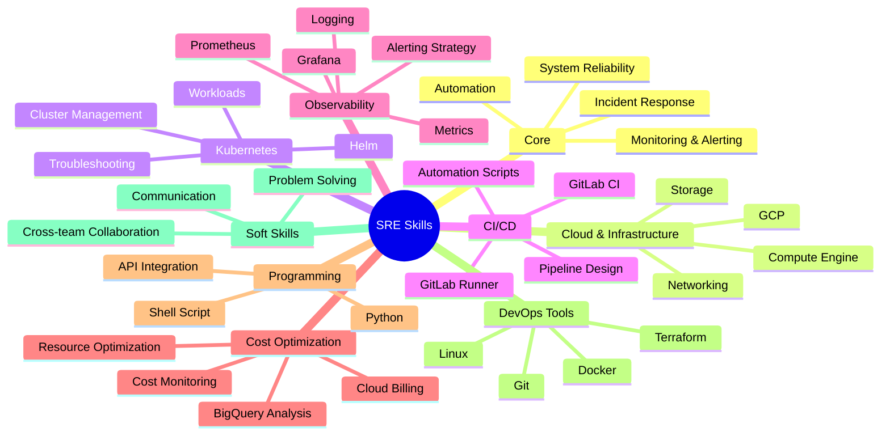
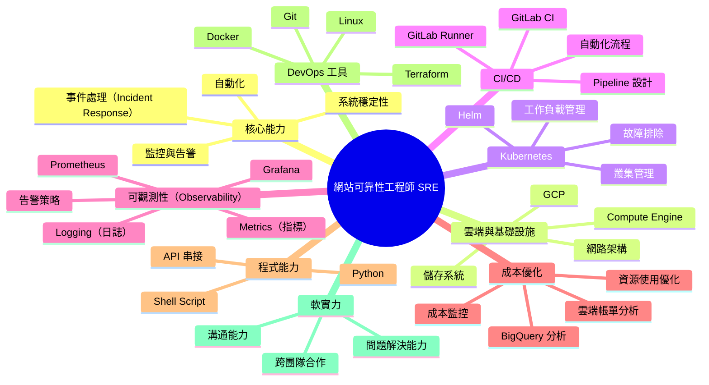

👋 Hi, I'm Ben  
👋 你好，我是 Ben

🚀 Site Reliability Engineer (SRE) focused on building scalable and reliable systems  
🚀 專注於打造可擴展與高可靠性的系統的網站可靠性工程師（SRE）

💡 Skilled in / 技術專長：
- Kubernetes / Cloud Native Architecture
- CI/CD Automation（GitLab Runner）
- Monitoring & Observability（Prometheus, Grafana）
- Cost Optimization（BigQuery, Cloud Billing）

🔧 Passionate about automating workflows, improving system reliability,  
and reducing operational overhead  
🔧 熱衷於自動化流程、提升系統穩定性，並降低維運成本

🌏 Based in Taiwan
🌏 現居台灣

📫 Feel free to connect or collaborate!  
📫 歡迎交流與合作！

---

---

## 📊 GitHub Stats

  

---

## 📈 Contribution Graph

---

## 🚧 Currently Working On
- Kubernetes cost monitoring & optimization  
- GitLab Runner usage tracking across teams  
- Cloud infrastructure automation  

## 🚧 目前專注
- Kubernetes 成本監控與優化  
- GitLab Runner 跨團隊使用分析  
- 雲端基礎設施自動化  
